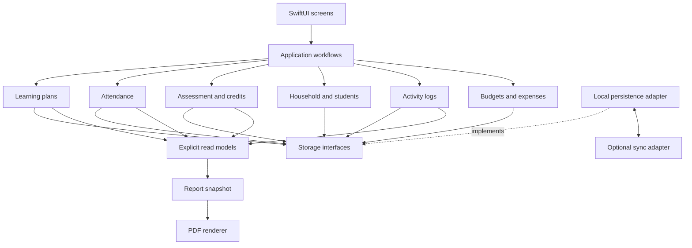
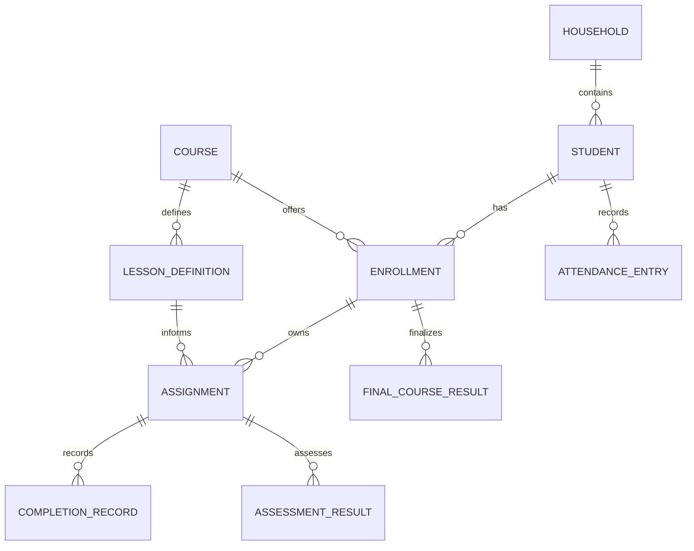
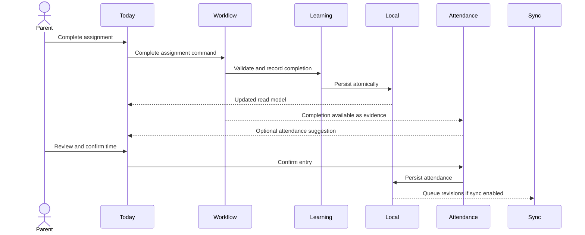
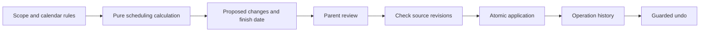

# Proposed software architecture

Status: design proposal, not an implemented architecture. Read alongside the [review](design-review.md) and [open decisions](roadmap.md).

## Structure

Build a SwiftUI application as a modular monolith. Keep business rules independent of views and storage vendors. Start with local persistence; add optional cloud synchronization after backup, identity, and conflict rules are established.



Arrows show conceptual dependencies and data flow. Business modules depend on interfaces; infrastructure implements them. Reporting consumes explicit read models, not another module's private tables. Today composes existing records rather than owning a second copy of progress or attendance.

## Modules and ownership

| Module | Owns | Important boundary |
|---|---|---|
| Household | Students, household membership, school years | Supplies stable identity and scope; authorization is enforced separately at access boundaries |
| Learning | Courses, lessons, enrollment, assignments, completion | Reusable content is separate from student-specific state |
| Attendance | Confirmed dates, instructional durations, corrections | Completion is evidence, not automatic attendance |
| Assessment | Scores, policies, final course results, credits | Raw averages and finalized academic results are different records |
| Activity logs | Reading, field trips, volunteer activities | Supports retrospective and multi-student learning |
| Budget | Budgets, categories, transactions | Receipt binaries live in attachment storage |
| Reporting | Report models, snapshots, rendering | No authority to alter source academic records |
| Infrastructure | Persistence, attachments, sync, platform adapters | No grading or scheduling policy in storage adapters |

Attendance and Assessment remain separate responsibilities even if initially distributed in one package. Avoid splitting every screen into a package.

## Core data relationships



Cardinality of completion events and revision history needs detailed design. Do not interpret this conceptual model as a finalized database schema.

- Lesson definition: reusable work and resources.
- Enrollment: a student taking a course in a school year.
- Assignment: scheduled or undated work belonging to an enrollment.
- Completion: actual date, state, and optional evidence/time; independent of planned date.
- Attendance: explicitly confirmed learning dates/time, with defined aggregation rules.
- Final course result: approved grade, credit, policy version, and revision metadata.
- Report snapshot: exact values and policy metadata used in a finalized export.

Use stable IDs. Model school dates separately from precise timestamps. Use consistent duration units. Store money as decimal values or integer cents. Define revision/deletion metadata before introducing synchronization.

## Complete a lesson



Use explicit workflows rather than a global event bus that silently turns every completion into attendance and grades. Events can notify observers without making educational policy implicit.

## Reschedule assignments



Keep completed work unchanged. Distinguish fixed-date from flexible assignments. Preview without mutating records. Reject or recalculate a stale proposal. Undo only when later edits have not invalidated the original operation.

Unresolved policy choices include workload limits, partial completion, skipping, dependencies, and whether missed days extend the finish date or compress later work.

## Reports

Read validated source records → apply explicit report policy → preview → finalize immutable snapshot → render PDF. Corrections create a new finalized version. A preview can remain live; a finalized issued record must not silently drift.

## Storage, sync, and permissions

1. Local persistence with migrations and complete export.
2. Backup/restore with recovery verification.
3. Optional identity and multi-device sync.
4. Shared editing with household/role enforcement and conflict resolution.

Expose saved-on-device, pending-sync, synced, and conflict states. Define retry/idempotency behavior, tombstones, attachment lifecycle, and revision checks. Avoid silent last-writer-wins for final grades and conflicting attendance corrections.

| Role | Assignments | Grades | Expenses | Membership |
|---|---|---|---|---|
| Parent/admin | Manage | Manage | Manage | Manage |
| Student | Own assigned work; completion submission | Own if enabled | None | None |
| Tutor, future | Assigned courses/students | Assigned scope | None | None |

Enforce restrictions in cloud access rules/services as well as the UI. Attachment links and exports need equivalent scoping.

## Suggested organization

```text
App/                         Navigation and dependency assembly
Features/                    Today, Planning, Records, Family
Modules/Learning/            Lessons, sequences, scheduling, completion
Modules/Attendance/          Time and attendance policy
Modules/Assessment/          Scores, credits, final results
Modules/Household/           Identity and membership
Modules/ActivityLogs/        Reading and other learning activities
Modules/Budget/              Expenses and budgets
Modules/Reporting/           Read models, snapshots, rendering
DesignSystem/                Reusable native UI components
Infrastructure/              Persistence, attachments, sync, platform adapters
```

Convert selected modules to local Swift packages when their boundaries justify it. No particular database, cloud provider, minimum OS, or billing implementation is selected in this baseline.

## Reuse for future apps

| Component | Reusable mechanism | Potential future use |
|---|---|---|
| Scheduling engine | Eligible dates, ordered work, previews | Coaching, training, maintenance |
| Completion tracking | State transitions and history | Habits, onboarding, professional development |
| Membership | Scoped users and roles | Family organizers, clubs, tutoring |
| Time/activity logs | Dated entries and duration aggregation | Practice journals and certification hours |
| Budget | Categories, monetary transactions, summaries | Projects and household expense tools |
| Reporting | Structured snapshots and document rendering | Certificates and client progress reports |
| Attachments | Storage references, access, lifecycle | Portfolios, receipts, document organizers |
| Design system | Accessible forms, lists, navigation states | Other native iOS products |

Reuse mechanisms while keeping educational policy specific. A scheduler need not know algebra; a PDF renderer need not calculate GPA. Avoid a universal task/record abstraction that erases the differences between grades, expenses, and completion. Extract shared libraries when a second real use case proves the interface.
